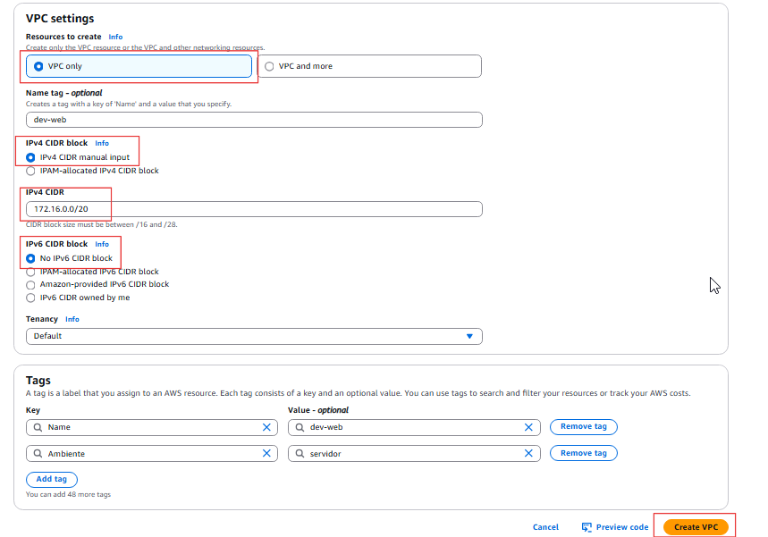
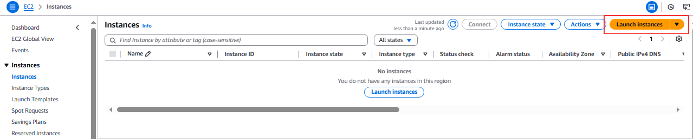
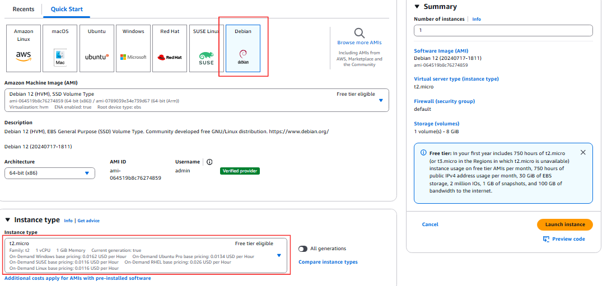
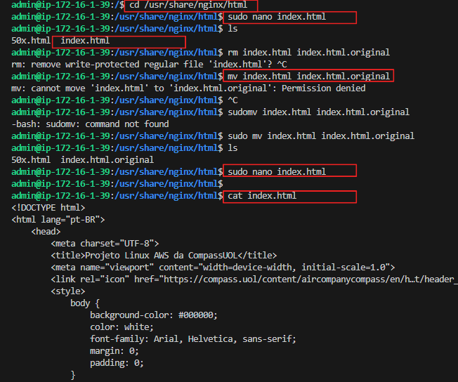
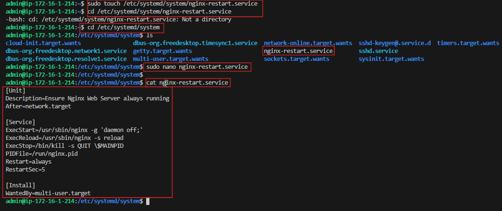

# <h1 align="center">Projeto Linux</h1>

## Configuração de Servidor Web com Monitoramento

## Ferramentas utilizadas

**Aplicações utilizadas :** AWS, Vscode, Linux (Debian12).

### Etapa 1: Configuração do Ambiente:

Primeiro crie uma VPC na AWS com 2 subnets publicas e 2 subnets privadas. Localize na barra de pesquisar por VPC para criar as subnets:
depois clique em create VPC.


Em VPC setting voce pode escolher por criar atraves do VPC only ou VPC and more. neste exemplo escolheremos VPC only, após escolher informe um nome para vpc ex: "dev-web" e o bloco IPV4 CIDR para a VPC neste exemplo usei 172.16.0.0/20. as outros opções pode deixar como default.



Agora criaremos 2 subnetes privadas e 2 publica conforme a imagem abaixo. para isto na console da AWS em VPC clique em subnetes -> create subnet.

selecione a VPC criada anteriormente com o nome "dev-web", coloque o nome da subnete como "dev-web-public01, dev-web-public02, dev-web-private01, dev-web-private02.

selecione a zona de disponibilidade para cada subnet respectivamente de preferencia uma em cada zona. informe o IPV4 subnet CIDR block.

dev-web-public01 = 172.16.0.0/24
dev-web-public02 = 172.16.1.0/24
dev-web-private01 = 172.16.8.0/24
dev-web-private02 = 172.16.9.0/24


aqui são mostrados as subnets criadas.


quando é criado uma VPC ja vem criado uma tabela de roteamento por padrão. mas para nossa subnet funcionar de forma pública criaremos uma nova tabela de roteamento para as subnetes publicas.

primeiramente criaremos um internet gateway. ir em internet gateway, informe um nome para seu internet gateway por exemplo "igw01" e clique em create internet gateway. apos a criação teremos que associar a uma vpc.


para associar selecione o internet gateway criado -> actions -> attach to VPC -> selecione a VPC e assossiar.


Agora criaremos a tabela de roteamento.

ir em route table -> create route table -> informe um nome no exemplo usei "rtb_public" selecione a vpc "dev-web" e create route table.


apos a criação do route table com a route table selecionada ir na aba subnet associations, editar subnet associatios, selecione as subnetes publicas e salve. 


Agora em routes vamos editar a tabela de roteamento(edit routes). clique em editar e adicionar uma nova rota. 
para isso clique Add route pesquise por 0.0.0.0/0 em target selecione o internet gateway criado anteriromente e salve as mudanças.


Agora para criar o NAT gateway para a subnet privada ter acesso a internet.

para isto ir em NAT gateway informe um nome, selecione uma subnet public, aloque um Elastic Ip allocation ID. 
logo apos criaremos a tabela de roteamento para o NET gateway e assossiar as subnets privadas.


Agora assossiar a subnet privadas.


Agora iremos editar em Routes para que elas tenham acesso a internet. ir em edite routes adicionar a rota para NAT gateway.


## Criar uma instancia EC2

para criar uma instância EC2 na AWS va para a console da AWS e pesquise por EC2, procure por Launch instance. 




Nesta etapa coloque as Tags caso necessario. Escolha a imagem AMI, neste usei o Debian 12, em tipo da instancia deixe como t2.micro, crie uma key pair para acesso remoto via SSH, selecione a VPC "dev-web" criada anteriormente e asubnet publica, em security group crie uma caso nao tenha. para criar va em EC2 security group, clique em Create security group, informe um nome por exemplo usei "MyDevWeb" descrição pode adicionar para facilitar caso necessite identificar, selecione a VPC "dev-web" e clique create security group. deixe as outras opções como default por enquanto. e clique em criar instancia(Launch Instance).




Agora para associar um Security Group que permita tráfego HTTP (porta 80) e SSH na (porta 22) edite o security group permitindo regras de entrada de SSH e HTTP. Em security group selecione o security group criado "MyDevWeb" na aba Inbound rules clique em Edite inbound rules. adicione o type como HTTP, source selecione MyIP, adicione novamente para type SSH source MyIP e Salve(save rules).


Apos isto realize o teste acessando o servidor via SSH
Abra um cliente SSH como o PUTTY ou VSCODE usando o terminal bash instalado. neste exemplo usei o Vscode.

Localize a pasta com seu arquivo de chave privada .pem. A chave usada para iniciar esta instância.

Execute este comando, se necessário, para garantir que sua chave não seja visível publicamente.
chmod 400 "chave01.pem".

Na console da AWS selecione sua instância criada e com botão direito va em conect para conectar-se a instância. 


Agora selecione a aba SSH e copie ou digite o comando para conetar a instancia via SSH.

Conecte-se à sua instância usando seu IP público (Public IPv4 address)


Exemplo:

**ssh -i "chave.pem" admin@"IP_Public_IPv4_da_instância"** , na tela do terminal confirme com yes e acesse a maquina.


## Etapa 2: Configuração do Servidor

### 1 - Instalar o Servidor Nginx

Agora que estamos acessando terminal da nossa instancia AWS 
vamos atualizar os pacotes para depois instalar o servidor NGINX, 
para isso digite o comando:</br>
<b>sudo apt update</b> conforme imagem abaixo.


Outra etapa é instalar as dependências necessárias e transferir dados para o servidor, 
chave GPG, ca-certificates e lsb-release para fornecer informações da distribuição 
Linux instalada para isto use:</br>
**sudo apt install -y curl gnupg2 ca-certificates lsb-release**.

Logo após execute o comando para adicionar a chave de assinatura e configurar o repositorio do Nginx, 
observe que ao adicionar criamos e salvamos o arquivo em nginx.list.

comando para baixar a assinatura: **curl -fsSL https://nginx.org/keys/nginx_signing.key | sudo apt-key add -**
 
depois execute: **echo "deb http://nginx.org/packages/debian $(lsb_release -cs) nginx" | sudo tee /etc/apt/sources.list.d/nginx.list**

para que adicione o repositório oficial do Nginx ao arquivo de fontes de pacotes.

Atualize a lista de pacotes com <b>sudo apt update</b>.


Execute **sudo apt install nginx -y** para instalar o servidor.


Consulte se o nginx foi instalado pesquisando sobre a versão com **sudo nginx -v**.

ative o Nginx para iniciar **sudo systemctl enable nginx**.


### 2 - Criar uma pagina HTML simples.

Agora com o NGINX instalado vamos criar nossa pagina HTML simples, para isto navegue até o diretorio que serve a pagina html do nosso Servidor em <b>cd /usr/share/ngin/html</b> verifique o arquivo index.html, caso queiro salve o arquivo original com o nome index.html.original e crie um novo index.html com o comando <b>sudo nano index.html</b> e digite ou cole o seu codigo HTML depois salve o arquivo.



podemos usar o comando **cd /usr/share/nginx/html | cat index.html**
 para verificar se o conteudo foi criado.


Ative o nginx com **sudo systemctl enable nginx --now** depois verifique se o nginx está ativo e servindo a pagina corretamente.


Abra o terminal e digite o http://"ip_da_instancia_publica"


Caso o Servidor sofra uma parada repentina podemos criar um serviço systemd para 
garantir que o Nginx reinicie automaticamente caso para repentinamente. para criar ou 
editar um arquivo de serviço para garantir que o Nginx seja reiniciado automaticamente 
vamos criar o serviço **nginx-restart.service**. para isto voce pode criar o arquivo 
usando o touch e depois editar **sudo touch /etc/systemd/system/nginx-restart.service**. 
e depois editar com **sudo nano /etc/systemd/system/nginx-restart.service**

No arquivo edite escrevendo as instruções **[UNIT]** para descrever o serviço e o modo de reinicialização, 
**[SERVICE]** para informar ao systemd como gerenciar, **[INSTALL]** como o serviço será instalado e configurado 
para iniciar automaticamente.


```
[Unit]
Description=Ensure Nginx Web Server always running
After=network.target

[Service]
ExecStart=/usr/sbin/nginx -g 'daemon off;'
ExecReload=/usr/sbin/nginx -s reload
ExecStop=/bin/kill -s QUIT \$MAINPID
PIDFile=/run/nginx.pid
Restart=always
RestartSec=5

[Install]
WantedBy=multi-user.target
```


Salve o arquivo e execute o comando <b>sudo systemctl 
daemon-reload<b> para habilitar e iniciar o serviço de 
reinício automático. reinicie o Nginx para validar as 
configurações com <b>sudo systemctl enable nginx-restart --now</b> e inicie o servidor <b> sudo systemctl start nginx</b>

## Etapa 3:

Ter um site e não monitorar sua disponibilidade pode ser arriscado, pois você pode perder visitantes ao seu site e possíveis clientes sem perceber problemas em seu Servidor. Monitorar é essencial para garantir a estabilidade e resolver falhas rapidamente. Então vamos criar um script que verifique a disponibilidade do site.

crie um script em Bash ou Python para monitorar a disponibilidade do site. 

Antes disso vamos criar uma conta no Slack que é uma plataforma de comunicação e colaboração projetada para equipes e empresas.

para criar uma conta no Slack e instalar a API Webhook acesse o site do Slack clique em Começar para criar uma conta. informe um e-mail e será enviado um codigo no seu email, informe o codigo. ao acessar o site voçê pode criar um workspace.
</br>
Na proxima tela informe o nome da empresa ou equipe.

Agora para instalar a API Webhooke acesse o site https://api.slack.com/apps . depois habilite Incoming Webhooks em features, e ative a opção Incoming Webhooks.

</br>

Adicione um novo Webhook ao workspace clique em "Add New Webhook to Workspace" e escolha o canal onde as mensagens serão postadas. No nosso exemplo crie um Channel com nome de "projetolinux". Copie a URL do Webhook para informar no script a variável "SLACK_WEBHOOK_URL". o webhook do Slack permite que o script envie notificações para um canal específico no Slack.

Vamos criar tambem um log para armazenar logs das verificações de disponibilidade do site. para isto crie em <b>cd /var/log</b> o arquivo <b>monitoramento.log</b>
execute o comando sudo com o <b>touch</b>, o touch irá criar um arquivo em branco. depois execute o comando <b>sudo chmod 644 /var/log/monitoramento.log</b> para alterar permissões.  

</br>

execute o comando para mudar a propriedade de um arquivo ou diretório para o usuário atual <b>sudo chown $USER:$USER /var/log/monitoramento.log</b>

</br>


Crie um arquivo chamado monitoramento_web.sh no diretório /usr/local/bin com ocomando <b>sudo nano /usr/local/bin/monitoramento_web.sh</b> onde criaremos o scritp com a extensão <b>.sh</b>.

```
#!/bin/bash

##### para enviar as informações de logs para o slack
LOGFILE="/var/log/monitoramento.log"</br>
SLACK_WEBHOOK_URL="substituir pelo URL do webhook do Slack"

##### para capturar o IP público da instancia da AWS
TOKEN=$(curl -X PUT "http://169.254.169.254/latest/api/token" -H "X-aws-ec2-metadata-token-ttl-seconds: 21600")
PUBLIC_IP=$(curl -H "X-aws-ec2-metadata-token: $TOKEN" -s http://169.254.169.254/latest/meta-data/public-ipv4)

##### verificar se oIP público foi adiquirido
if [ -z "$PUBLIC_IP" ]; then
    echo "$(date): erro ao obter o IP público da instância" >> $LOGFILE
    exit 1
fi

##### montar a URL do site
SITE_URL="http://$PUBLIC_IP"

##### verificar se o nosso de arquivo de log monitoramento.log existe 
if [ ! -f "$LOGFILE" ]; then
    sudo touch "$LOGFILE"
    sudo chmod 666 "$LOGFILE"
fi

##### enviar notificação para o Slack
send_slack_notification() {
    message="$1"
    payload="{\"text\": \"$message\"}"
    curl -X POST -H "Content-type: application/json" --data "$payload" "$SLACK_WEBHOOK_URL"
}

##### aqui verifica a resposta do site
response=$(curl --write-out "%{http_code}" --silent --output /dev/null "$SITE_URL")

if [ "$response" -ne 200 ]; then
    log_message="$(date): $SITE_URL is down (HTTP status: $response)"
    echo "$log_message" >> $LOGFILE
    send_slack_notification "$log_message"
else
    log_message="$(date): $SITE_URL is up (HTTP status: $response)"
    echo "$log_message" >> $LOGFILE
fi
```


Após criar e verificar o script salve o arquivo e execute o comando <b>sudo chmod +x /usr/local/bin/monitoramento_web.sh</b> para tornar o script executavel.

Agora vamos criar uma tarefa com o Cron para executar o script a cada minuto, para isto execute o comando: 
<b>sudo contrab -e</b> parae ditr as tarefas. por padrão o Cron não vem instalado em distribuições linux para instalar execute o comando <b>sudo apt install cron -y</b>. no editor adicione a seguinte linha <b>* * * * * /usr/local/bin/monitoramento_web.sh</b> ela é representada por astericos que na ordem corresponde ao minuto, Hora, Dia do Mes, Mes, Dia da Semana - juntos significa que vai ser executadoa cada minuto seguido do caminho do script criado monitoramento.sh, para vizualizar se o arquivo foi adicionado execute o listar com <b>crontab -l</b>


Enviar uma notificação via Discord, Telegram ou Slack se detectar indisponibilidade.


Etapa 4 -


Verificar e Testar
Executar o Script Manualmente:

Execute o script manualmente para verificar se ele está funcionando e enviando notificações:

bash
sudo ./monitoramento_web.sh


Verificar Notificações no Slack:

Abra o canal do Slack onde você configurou o webhook e verifique se recebeu uma notificação indicando o status do site.


Verificar o Arquivo de Log:

Verifique se o arquivo de log está sendo criado e atualizado corretamente:

bash
cat /var/log/monitoramento.log