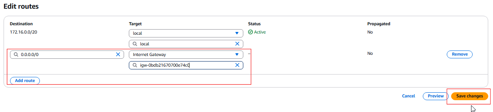
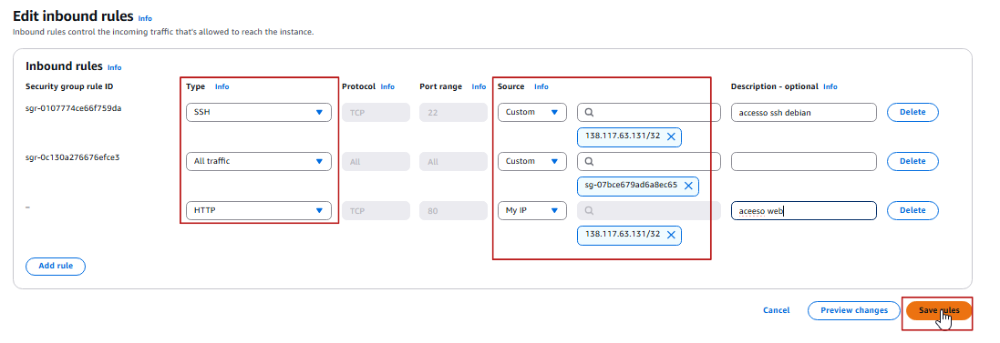

# Projeto Linux

## Configuração de Servidor Web com Monitoramento

### Etapa 1: Configuração do Ambiente:

Primeiro crie uma vpc com 2 subnets publicas e 2 subnets privadas. Localize na barra de pesquisar por VPC para criar as subnets:
clique em create VPC.

Em VPC setting voce pode escolher por criar atraves do VPC only ou VPC and more. neste exemplo escolheremos VPC only, após escolher informe um nome para vpc ex: "dev-web" e o bloco IPV4 CIDR para a VPC neste exemplo usei 172.16.0.0/20. as outros opções pode deixar como default.

Agora criaremos 2 subnetes privadas e 2 publica conforme a imagem abaixo. para isto na console da aws em vpc clique em subnetes create subnet.

selecione a vpc criada anteriormente com o nome "dev-web", coloque o nome da subnete como "dev-web-public01, dev-web-public02, dev-web-private01, dev-web-private02.

selecione a zona de disponibilidade para cada subnet respectivamente de preferencia uma em cada zona. informe o IPV4 subnet CIDR block.

dev-web-public01 = 172.16.0.0/24
dev-web-public02 = 172.16.1.0/24
dev-web-private01 = 172.16.8.0/24
dev-web-private02 = 172.16.9.0/24

aqui são mostrados as subnets criadas.

quando criado uma vpc ja vem criado uma tabela de roteamento por padrao. mas para nossa subnet funcionar de forma publica criaremos uma nova tabela de roteamento para as subnetes publicas.

primeiramente criaremos um internet gateway. ir em internet gateway, informe um nome para seu internet gateway por exemplo "igw01" e clique em create internet gateway. apos a criação teremos que associar a uma vpc.

para associar selecione o internet gateway criado -> actions -> attach to VPC -> selecione a vpc e assossiar.

Agora criaremos a tabela de roteamento.

ir em route table -> create route table -> informe um nome no exemplo usei "rtb_public" selecione a vpc "dev-web" e create route table.

apos a criação do route table com a route table selecionada ir na aba subnet associations, editar subnet associatios, selecione as subnetes publicas e salve. 

Agora em routes vamos editar a tabela de roteamento(edit routes). clique em editar e adicionar uma nova rota. 
para isso clique Add route pesquise por 0.0.0.0/0 em target selecione o internet gateway criado anteriromente e salve as mudanças.

Agora para criar o NAT gateway para a subnet privada ter acesso a internet.

para isto ir em NAT gateway informe um nome, selecione uma subnet public, aloque um Elastic Ip allocation ID. 
logo apos criaremos a tabela de roteamento para o NET gateway e assossiar as subnets privadas.

Agora assossiar a subnet privadas

Agora iremos editar em Routes para que elas tenham acesso a internet. ir em edite routes adicionar a rota para NAT gateway.

## criar uma instancia EC2

para criar uma instância EC2 na AWS va para a console da AWS e pesquise por EC2, procure por Launch instance. 

Nesta etapa coloque as Tags caso necessario. Escolha a imagem AMI, neste usei o Debian 12, em tipo da instancia deixe como t2.micro, crie uma key pair para acesso remoto via SSH, selecione a vpc "dev-web" criada anteriormente e asubnet publica, em security group crie uma caso nao tenha. para criar va em EC2 security group, clique em Create security group, informe um nome por exemplo usei "MyDevWeb" descrição pode adicionar para facilitar caso necessite identificar, selecione a VPC "dev-web" e clique create security group. deixe as outras opções como default por enquanto. e clique em criar instancia(Launch Instance).

Agora para associar um Security Group que permita tráfego HTTP (porta 80) e SSH na (porta 22) edite o security group permitindo regras de entrada de SSH e HTTP. Em security group selecione o security group criado "MyDevWeb" na aba Inbound rules clique em Edite inbound rules. adicione o type como HTTP, source selecione MyIP, adicione novamente para type SSH source MyIP e Salve(save rules).

Apos isto realize o teste acessando o servidor via SSH
Abra um cliente SSH.

Localize seu arquivo de chave privada. A chave usada para iniciar esta instância.

Execute este comando, se necessário, para garantir que sua chave não seja visível publicamente.
chmod 400 "chave01.pem"

Conecte-se à sua instância usando seu IP público (***.***.***.***)

Exemplo:

ssh -i "chave.pem" admin@192.168.0.1

## Etapa 2: Configuração do Servidor